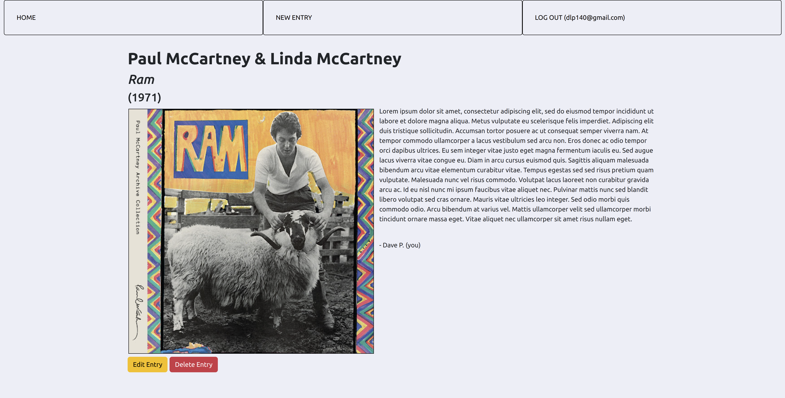

# Foggy Dog Music Blog

#### An full-stack, full-CRUD web application for users to create, read, update, and delete album reviews.

## Description

Users are able to read any previous contributions. If the user has registered and is logged in, they are able to contribute to the site. Additionally, they are able to edit or delete and of their previous contributions.

## Technologies Used

- HTML5
- CSS3
- JavaScript
- Express
- Bootstrap
- Express
- MongoDB
- Mongoose

## Features

- Upon entering the site, users can click on album artwork to be brought to that album's specific page containing album information and user contributed comments
- Users have the option to register and subsequently log-in
- Authenticated users can create posts on the site
- Authenticated users can edit or delete any of their previous contribution

## Wireframe

- <a href='https://trello.com/b/S2Vh9DSH/project-2-music-blog'>Wireframe</a>

## Trello Planning

- <a href='https://trello.com/b/S2Vh9DSH/project-2-music-blog'>Trello</a>

## Project's Future

- Users will be able to pin or favorite specific contributions
- Dashboard view for users to see their contributions and their favorite posts
- Multiple contributions related to the same album will be consolidated onto a single page
- API call to third-party site to retrieve album information for user

## Deployed Link

- https://foggy-dog-music-blog.herokuapp.com/
